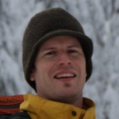

Mr. Samuel George Clarke
========================

Personal Details
----------------

* **Date of Birth:** 15 February 1978
* **Nationality:** British
* **Current Residency:** Vancouver, Canada 
* **Telephone:** 604 720 9056
	
* **Email:** samclarke.g@gmail.com

Employment Experience
---------------------

11/2017-present
~~~~~~~~~~~~~~
**CTO, Senior Developer** 

Zig, Vancouver, B.C., Canada. https://zigtheapp.com/

*  Responsible for evaluating and implementing new systems and infrastructure. Ensuring technologies are used efficiently, profitably and securely. Recruitment and management of the development team.

16/2015-present
~~~~~~~~~~~~~~~
**Lead Developer**

Scriptspeaker, Vancouver, B.C., Canada. https://app.scriptspeaker.com/

* Responsible for design and execution of the software aspects of the application. Fullstack development. 

9/2013-10/2017
~~~~~~~~~~~~~~
**Technical Director, Lead Developer** 

Rival Schools, Vancouver, B.C., Canada. http://rivalschools.tv/

* Co-ordination and engineering of web applications. Responsibilities include design and implementation of both backend and front-end technologies, as well as devops and data integrity. Additionally my role involves deveoping standardised systems for bootstrapping and deploying applications on a distributed cloud architecture. 
 
10/2012-9/2013
~~~~~~~~~~~~~~
**Django Developer**

Rival Schools, Vancouver, B.C., Canada. http://rivalschools.tv/

* Creation of a web-based configurator tool for use in the Solar Mounting industry.

9/2010-8/2012
~~~~~~~~~~~~~~     
**Web Development Consultant**

Charles Darwin Foundation, Galapagos Islands, Ecuador. https://www.darwinfoundation.org/en/datazone

* Development of scientific web applications, database standards and web interfaces.

1/2009-6/2010
~~~~~~~~~~~~~~
**Professional Volunteer**

Charles Darwin Foundation, Galapagos Islands, Ecuador

* Web development, specifically templates for a full redesign of institutional web site, development of scientific applications and database management.
* Various duties with BIOMAR Marine Investigation Dept. involving Scientific diving, marine life field guide development production, species identification and outreach.

2/2005-6/2007
~~~~~~~~~~~~~~
**Scientific Observer**

(Various Contracts)        Falkland Islands Fisheries Dept., Falkland Islands

* Responsible for collecting primary scientific data aboard commercial fishing vessels.
* Responsible for monitoring license compliance aboard vessels within Falkland Islands’ waters.
* Expected to carry out various scientific work on marine specimens in the wet lab on land. Completed diet study of *Eleginops maclovinus*. (paper published).

1/2004–3/2004
~~~~~~~~~~~~~~
**English Language Teacher**

Eccinoquial Escuela de Lingua. Cuenca, Ecuador, S.A.

* Responsible for planning and delivering English language courses at a range of levels.
* Produced an entire educational course entitled “English for Computers”. 

8/2002–1/2004
~~~~~~~~~~~~~~
**Scientific Observer**

Falkland Islands Fisheries Dept. Falkland Islands

* See Above

Education
---------

2000–2001
~~~~~~~~~	
**University of Surrey.** Guilford, England

* Post Graduate Diploma Toxicology

1996-1999
~~~~~~~~~   
**University of Warwick.** Coventry, Warwickshire, England

* BSc (Hons) 2:1 Microbiology

1994-1996 
~~~~~~~~~        
**Bungay High School.** Bungay, Suffolk, England

* S’Level: Biology (Merit)
* A’level : Biology (B), History (B), Chemistry (C), Art (C)

1992-1994
~~~~~~~~~          
**Newport Free Grammar School.** Newport, Essex

* GCSE: Maths (B), English Language (A), English Literature (A), Biology (A),Chemistry (B), Physics (A), Geology (A*), Art (A*), French (B), History (B).

Web Resources
-------------

* **Github:** https://github.com/samgclarke
* **Slide Decks:** https://slides.com/samrivals
* **Blog:**      http://djangosteps.wordpress.com

Conferences and Speaking
------------------------
**Python Web Conference 2020** - Remote

* Talk: “Monitoring and Testing web applications in the wild.” https://2020.pythonwebconf.com/presentations/testing-and-monitoring-web-applications-in-the-wild
* https://www.youtube.com/watch?v=WRfyod2cMSs

**PyTennessee 2020** - Nashville, Tennessee

* Talk:  “Monitoring and Testing web applications in the wild.” https://github.com/samgclarke/pytennesee_2020

**PyCarribean 2016** - Puerto Rico

* Talk: “Celery Demystified.” https://youtu.be/7ZkZr7apcJs
         
**DjangoCon US 2011** - Portland, Oregon, USA

**PyCon US 2012** - Santa Clara, California, USA

* Lightning Talk: “Python in the Wild. Developing with Django in the Galapagos Islands.”

**PyCon US 2014** - Montreal, Quebec, Canada

* Member of the Pycon Talk Review Board

* Session chair and session runner

Professional Skills
-------------------

Specialist in full stack web application architechture, from server provisioning to REST APIs to responsive CSS optimization.

Python
~~~~~~~~~~~~~~

Django, Flask, PIP, virtualenv, virtualenvwrapper, Fabric, South, numpy, Matplotlib, Sphinx documentation (ReStructuredText), Django-debug-toolbar, Ipython, Bpython, Pandas, GeoDjango.

Javascript
~~~~~~~~~~

AngularJS, JQuery, Javascript, jQuery, Angular Material, Protractor, NPM, Bower, Grunt, Gulp, D3.js, Highcharts.js.

Mobile Application Development
~~~~~~~~~~~~~~~~~~~~~~~~~~~~~~

Ionic hybrid framework, Cordova, CSS media-queries, responsive design.

Experience with other languages/ tools
~~~~~~~~~~~~~~~~~~~~~~~~~~~~~~~~~~~~~~

Linux, Bash, PHP, HTML/XHTML, Google Maps API V3, Apache, NGINX, MySQL, Postgres, MongoDB, PostGIS, GDAL, SSH, GIT version control, OSM.

Other
~~~~~

GIS (Quantum GIS), Photoshop, GIMP.

Organizations
--------------

Pycon 2014 Talk Reviewers Team, DjangoVan, Vancouver Python Users Group, VanJS, AngularJS Vancouver

Other Skills and interests
--------------------------

**Languages:** Spanish (fluent), Italian, French and German (basic)
Sports: Snowboarding, skateboarding, paddleboarding, squash, hiking, surfing and SCUBA diving (PADI Advanced Open Water).

**Traveling:** Areas visited include Eastern and Western Europe, Northern and Southern Africa, North America, Central and South America.

**Other:** Digital Music Production and DJ
­

Professional References
-----------------------
**Neil McBean**

* Owner/ CEO
* Kracker Cloud Technologies
* 46 West 6th Avenue
* Vancouver
* British Columbia V5Y 1K1
* neil@kracker.io

**David Lam**

* Executive Director
* Rival Schools
* 46 West 6th Avenue
* Vancouver
* British Columbia V5Y 1K1
* david@rivalschools.tv

**Dr. Frank Bungartz**

* Theme Leader, Biodiversity Assessment
* Cryptogamic Botanist & Head of Natural History Collections
* Charles Darwin Foundation (AISBL)
* Puerto Ayora, Santa Cruz
* Galápagos, Ecuador
* frank.bungartz@gmail.com

